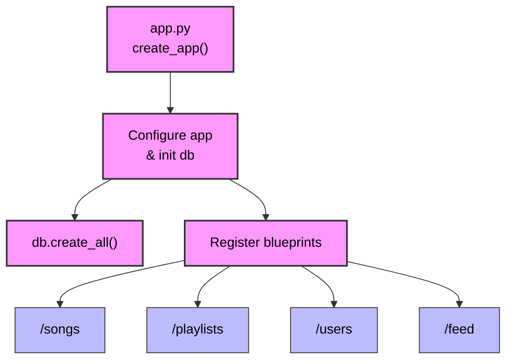
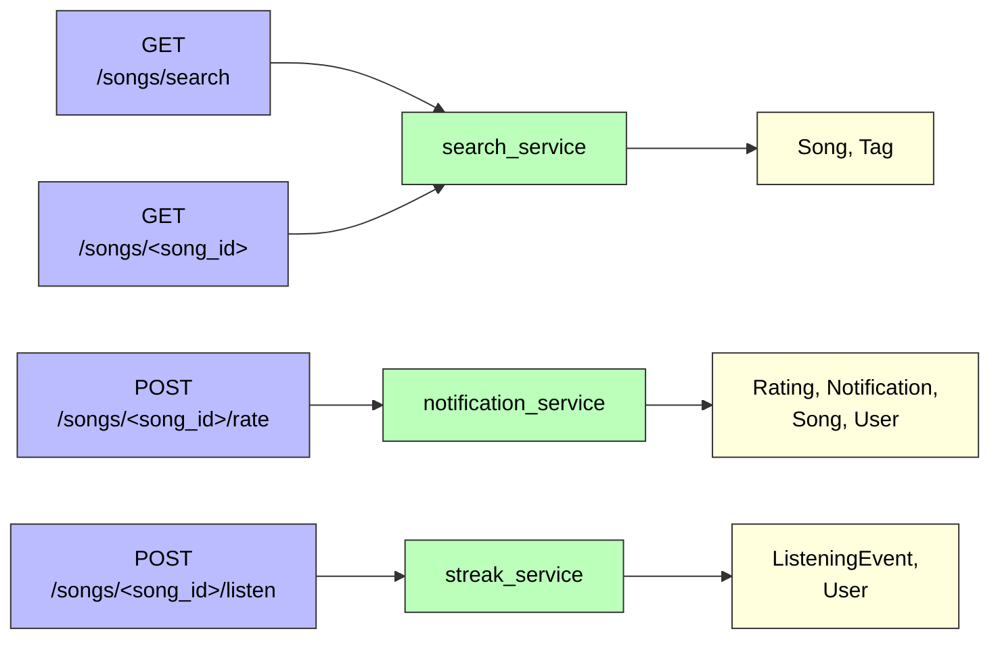
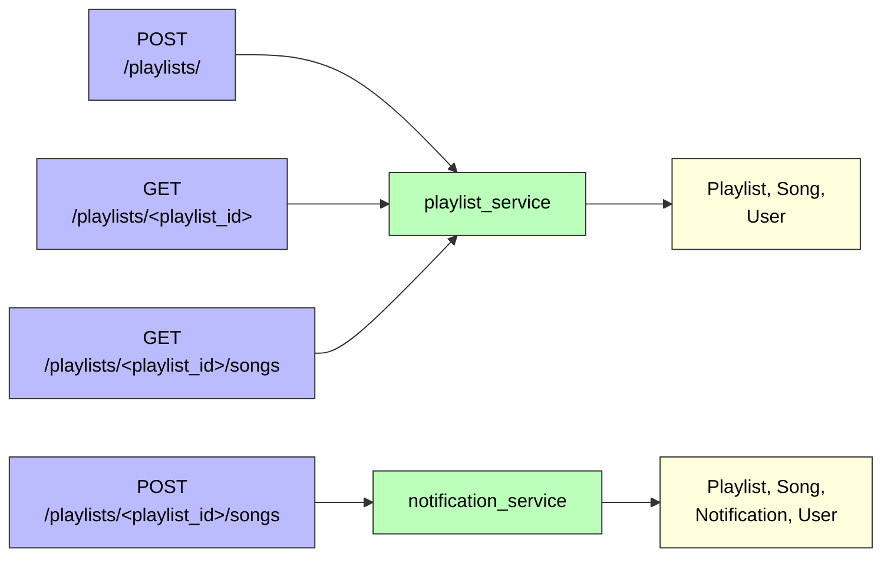
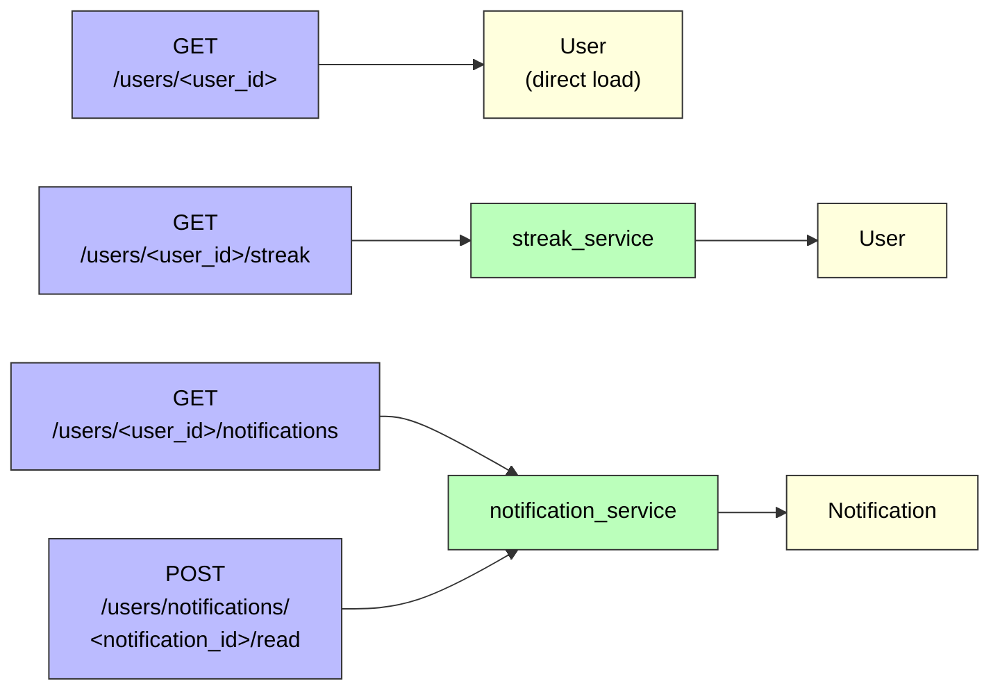
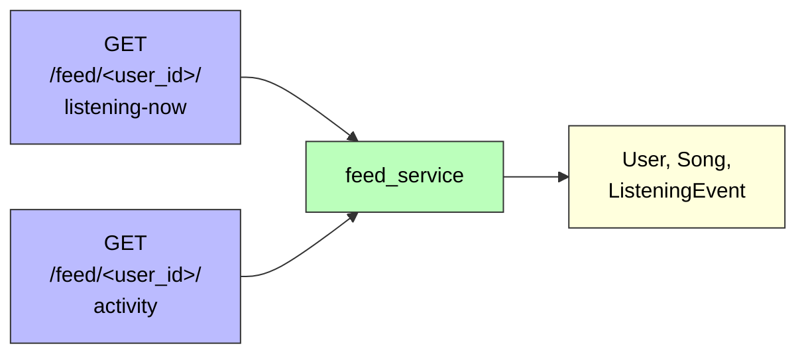

# Project 5: Mixtape Bug Hunt — Submission

## AI Usage

I used an AI coding agent (Claude Code) throughout this project for codebase navigation, debugging, and documentation, under a fixed process: for every bug, the AI first wrote a regression test that had to **fail** (proving it captured the bug's behavior), then traced from symptom to root cause and presented findings for my review — no fix was applied until I approved it. Each fix was the smallest change that resolved the issue, verified by running the full test suite, and committed by me, one conventional-format commit per bug.

**How I used AI during codebase navigation:**
- Before starting any bug work, I generated a codebase map (file roles, data flows) and an app-flow diagram. The map deliberately recorded unverified guesses with "likely..." hedges; those were confirmed or corrected later by actually reading the code.
- I had the AI explain the existing test suite in detail and run it to establish a baseline (13 tests, 3 failing) before changing anything.
- The AI traced call chains route → service → model (e.g., `POST /songs/<song_id>/rate` → `routes/songs.py` → `notification_service.rate_song()`) rather than jumping straight to service files.

**What AI tools helped me understand:**
- The layered architecture and where each issue's symptom entered the code.
- pytest's import-root rules — a `ModuleNotFoundError: No module named 'app'` after moving a test into `tests/regression/` turned out to be a missing `__init__.py`, not a broken test.
- The subtlest finding of the project: bug 3's duplicate rows were *latent*. The existing no-duplicate tests passed because SQLAlchemy's legacy `Query.all()` API deduplicates full-entity rows as a deprecated side effect. The AI probed the service's actual SQL and showed 3 raw rows for 1 returned song.
- Mermaid syntax rules (quoting labels containing `()` and `&`, entity-encoding `<>`), when the flow diagram failed to render.

**Where I verified or overrode AI output:**
- **Verified everything empirically.** No fix was accepted on explanation alone: every regression test had to fail before the fix and pass after it, and the full suite was re-run after each change (13 → 26 tests, all passing at the end).
- **Bug 3:** I did not accept "the tests pass" at face value — the AI ran a probe comparing the service's output count against the raw SQL row count (1 vs 3) to prove the defect was real before we changed anything.
- **Bug 2:** the AI flagged that the intended recency window wasn't stated in code, only in seed-data comments; I made the call to use 30 minutes.
- **Bug 4:** the AI presented a design choice (notify on every rating vs. only new ratings); I chose the smallest change consistent with the existing playlist flow.
- **Overrode an AI mistake:** an AI-written regression test asserted `notifications[0]["notification_type"]`, but the model's `to_dict()` serializes that column as `"type"`. The error surfaced immediately because we ran the tests; the test was corrected to match the model's contract.

---

## Commit History

One conventional-format commit per bug fix, on the `bugfix/mixtape` branch (visible in the shell prompt):

```
asbod@DESKTOP-K3L613K MINGW64 /c/codepath/ai201-project5-mixtape-starter (bugfix/mixtape)
$ git log --oneline
c44e1f8 fix: notify song sharer when a friend rates their song
d2236b1 fix: remove spurious song_tags join that multiplied search result rows
b72ede4 fix: narrow Friends Listening Now window from 24 hours to 30 minutes
dcc282b fix: correct Sunday boundary condition in streak reset logic
1172e5d fix: return all songs in get_playlists_songs instead of dropping the last one and added root cause analysis to the readme.md
```

| Commit | Bug fixed |
|--------|-----------|
| `1172e5d` | Bug 5 — The last song in a playlist never shows up |
| `dcc282b` | Bug 1 — My listening streak keeps resetting |
| `b72ede4` | Bug 2 — Friends Listening Now shows people from yesterday |
| `d2236b1` | Bug 3 — The same song keeps showing up twice in search |
| `c44e1f8` | Bug 4 — Not notified when a friend rated my song |

---

## Codebase Map

*(Written before starting any bug work; "likely" notes reflect pre-verification guesses.)*

### Root
- **app.py** — Main Flask app entrypoint. Configures routes, app setup, and starts the server.
- **models.py** — Defines the data models and database structures. Likely contains SQLAlchemy models or in-memory data classes for songs, playlists, users, etc.
- **README.md** — Project overview, setup instructions, and usage information.
- **requirements.txt** — Python dependency list for the project.
- **seed_data.py** — Script to populate initial data for the application. Used to load demo songs, playlists, users, or other seed records.

### Routes
- **\_\_init\_\_.py** — Route package initializer. Likely registers blueprints or imports route modules.
- **feed.py** — API endpoints related to feed content. Probably handles fetching recommended songs or activity feed.
- **playlists.py** — Playlist-related endpoints. Handles creating, viewing, updating playlists.
- **songs.py** — Song-related endpoints. Handles searching, listing, or retrieving songs.
- **users.py** — User-related endpoints. Handles login, signup, profile, or user state retrieval.

### Services
- **\_\_init\_\_.py** — Service package initializer.
- **feed_service.py** — Business logic for feed generation. May compute recommendations or feed items.
- **notification_service.py** — Notification-related logic. Likely handles creating and delivering notifications to users.
- **playlist_service.py** — Encapsulates playlist creation and management logic. Likely used by playlists.py.
- **search_service.py** — Search business logic for songs/playlists/users. Likely used by songs.py.
- **streak_service.py** — Tracks user streaks or activity streak logic. Provides streak computations and updates.

### Tests
- **\_\_init\_\_.py** — Initializes the test package.
- **test_playlists.py** — Tests for playlist functionality.
- **test_search.py** — Tests for search functionality.
- **test_streaks.py** — Tests for streak-related logic.

### Main App Flow

#### 1. App startup



Each blueprint below follows the same request path: **route → service → models**.

#### 2. Songs — `routes/songs.py`



#### 3. Playlists — `routes/playlists.py`



#### 4. Users — `routes/users.py`



#### 5. Feed — `routes/feed.py`



### Data Flow: Playlists

1. **Client request**
   - `POST /playlists/` to create a playlist
   - `GET /playlists/<playlist_id>` to fetch playlist metadata
   - `GET /playlists/<playlist_id>/songs` to list songs
   - `POST /playlists/<playlist_id>/songs` to add a song
2. **Route layer**
   - playlists.py receives request JSON / URL params.
   - Validates required fields like `name`, `created_by`, `song_id`, `added_by`.
3. **Service layer**
   - `create_playlist(...)` in playlist_service.py — loads `User` by `created_by`, creates `Playlist` row, commits to DB
   - `get_playlist(...)` — loads `Playlist` by ID, returns playlist dict
   - `get_playlist_songs(...)` — loads `Playlist`, queries `Song` joined through `playlist_entries`, orders by `playlist_entries.position`, returns song dict list
   - `add_to_playlist(...)` in notification_service.py — verifies `Song`, `User`, `Playlist`; appends song to `playlist.songs` association; commits; optionally creates a `Notification` if the adder is not the song sharer
4. **Data models**
   - `Playlist` stored in models.py
   - playlist-song relation stored via `playlist_entries` association table
   - ordered playlist entries use `position`, `added_by`, `added_at`
5. **Response**
   - route returns JSON for created playlist, playlist details, song list, or add-song success

### Data Flow: Search

1. **Client request** — `GET /songs/search?q=<query>`
2. **Route layer** — songs.py reads query string `q`; returns 400 if no query provided
3. **Service layer** — `search_songs(query)` in search_service.py queries `Song` records, filters by `Song.title.ilike(...)` or `Song.artist.ilike(...)`, returns list of `song.to_dict()` results
4. **Data models** — `Song` model stores title, artist, album, genre, shared_by, tags; `Tag` and `song_tags` provide song metadata for the search result payload
5. **Response** — route returns JSON with `results` array and `count`

### Data Flow: Streaks

1. **Client request** — `POST /songs/<song_id>/listen` with JSON `{ "user_id": ... }`
2. **Route layer** — songs.py validates `user_id`, calls `record_listening_event(user_id, song_id)`
3. **Service layer**
   - `record_listening_event(...)` in streak_service.py — loads `User` by ID, creates `ListeningEvent` with current UTC timestamp, calls `update_listening_streak(user, now)`, commits event and user changes
   - `update_listening_streak(...)` — if user has no prior `last_listened_at`, set streak to 1; if last listen was today, leave streak unchanged; if last listen was yesterday, increment streak; otherwise reset streak to 1; updates `user.last_listened_at`
4. **Data models** — `User` stores `listening_streak` and `last_listened_at`; `ListeningEvent` records each listen with `song_id` and timestamp
5. **Response** — route returns JSON of the created `ListeningEvent`; streak state is updated in the user record for later retrieval

*(A full field-by-field reference of the JSON returned by every endpoint is in `codebase_map.md`.)*

---

## Root Cause Analysis

Each entry covers the five required fields — **reproduction steps**, **navigation strategy**, **root cause explanation**, **fix description**, and **side-effect check** — plus a pointer to the regression test written for that bug (each regression test was written first and confirmed to fail against the buggy code before the fix was applied).

### Bug 1 — My listening streak keeps resetting

**Affected service:** `services/streak_service.py` — `update_listening_streak()`

**Reproduction steps:**

1. Create a user with no listening history.
2. Record a listen on a Saturday (e.g., `POST /songs/<song_id>/listen`, or call `update_listening_streak(user, now)` directly with Sat 2024-06-15 12:00 UTC). The streak becomes 1.
3. Record another listen the next day, Sunday 2024-06-16.
4. **Expected:** streak = 2 (consecutive days). **Actual:** streak resets to 1. Any other pair of consecutive days (e.g., Monday→Tuesday) increments correctly — the bogus reset happens only when the second day is a Sunday, which is why users saw week-long streaks "randomly" wiped once a week.

**Navigation strategy:** Running the shipped test suite as a baseline showed `tests/test_streaks.py::test_streak_increments_on_sunday` failing with `assert 1 == 2`, while the Monday→Tuesday consecutive-day test passed. I traced the flow `POST /songs/<song_id>/listen` → `routes/songs.py` → `record_listening_event()` → `update_listening_streak()`. A reset that occurs only on one specific weekday — while the day-difference arithmetic is demonstrably correct on other days — had to come from a day-of-week condition. The moment of confidence was reading the increment branch and finding exactly that: a `today.weekday() != 6` clause bolted onto the consecutive-day check.

**Root cause explanation:** The consecutive-day branch contained a spurious day-of-week condition:

```python
elif days_since_last == 1 and today.weekday() != 6:
    user.listening_streak += 1
else:
    user.listening_streak = 1
```

Python's `weekday()` returns 6 for Sunday. So when a user listened on Saturday and again on Sunday, `days_since_last` was 1 (consecutive — should increment), but the `today.weekday() != 6` clause made the condition false, execution fell into the `else`, and the streak was reset to 1. Every user's streak was wiped every Sunday regardless of how consistently they listened. The function's own docstring states the intended rule with no day-of-week exception: "If the user listened yesterday: streak increments by 1."

**Fix description:** Remove the spurious weekday clause so consecutiveness is judged purely by calendar-day difference:

```python
elif days_since_last == 1:
```

This is the smallest change that resolves the issue — one condition deleted, no other logic touched.

**Side-effect check:** The fix *relaxes* a condition on the increment branch, so the plausible side effect is over-incrementing — a Sunday listen counting as consecutive when a day was actually skipped. I wrote a dedicated guard for exactly that path: `test_skipping_into_sunday_still_resets` (Friday→Sunday skips Saturday, so the streak must still reset to 1), and confirmed it passes both before and after the fix. I then re-ran the full suite to confirm every other branch of `update_listening_streak()` still behaves: new-user streak starts at 1, same-day listens don't double-count, consecutive weekdays increment, skipped days reset — 18/18 passing. This check is sufficient because the guards collectively exercise every branch of the modified function.

**Regression test:** `tests/regression/test_streak_regression.py` — `test_saturday_to_sunday_is_consecutive` (Saturday then Sunday must give a streak of 2) and `test_week_long_streak_survives_sunday` (listening Monday through Sunday must give 7, not drop to 1 on day seven). Both failed against the buggy code — the streak stuck at 1 because the weekday clause forced every Sunday listen into the reset branch — and pass after the fix.

### Bug 2 — Friends Listening Now shows people from yesterday

**Affected service:** `services/feed_service.py` — `get_friends_listening_now()`

**Reproduction steps:**

1. Create two users and make them friends.
2. Create a `ListeningEvent` for the friend timestamped ~23 hours ago (or simply seed the database and wait — any event from yesterday works).
3. Request `GET /feed/<user_id>/listening-now`.
4. **Expected:** an empty feed — nobody is listening *now*. **Actual:** the friend appears as "listening now" with the day-old song. The same happens with an event just 2 hours old. Someone who played a song at 9 PM yesterday still appeared as listening "now" at 8 PM today.

**Navigation strategy:** The symptom ("people from yesterday") implied the recency filter was either missing or too wide. I traced `GET /feed/<user_id>/listening-now` → `routes/feed.py` → `get_friends_listening_now()`. Reading the function showed the filter present and correctly applied (`ListeningEvent.listened_at >= cutoff`), with correct ordering and per-friend deduplication — which narrowed the problem to the one remaining input: the threshold constant. The moment of confidence was the seed data: `seed_data.py` comments events "within the past 30 minutes" as *should appear in "listening now"* and events starting at just 2 hours old as *should NOT appear after fix* — both squarely inside the code's 24-hour window.

**Root cause explanation:** The query logic — filtering friends' listening events by a recency cutoff, ordering newest-first, and deduplicating to one entry per friend — was all correct. The bug was the recency constant itself:

```python
RECENT_THRESHOLD = timedelta(hours=24)
```

A 24-hour window means "listened at any point in the past day," not "listening now." The intended window is documented in `seed_data.py`, which seeds events "within the past 30 minutes" as *should appear in "listening now"* and events 2+ hours old as *should NOT appear after fix*. Showing older history is explicitly the job of the separate `get_activity_feed()` function, whose docstring notes it is "not filtered by recency."

**Fix description:** Set the threshold to the documented 30-minute window — a one-constant change:

```python
RECENT_THRESHOLD = timedelta(minutes=30)
```

The query, ordering, and deduplication logic were all correct and left untouched.

**Side-effect check:** Two things could plausibly break: the window could become *too narrow* (hiding genuinely current listeners), and the neighboring activity feed could be affected. For the first, `test_friend_listening_minutes_ago_is_shown` guards that a friend who listened 10 minutes ago still appears — it passed before and after the fix. For the second, I verified that `get_activity_feed()` in the same file does not use `RECENT_THRESHOLD` at all — its docstring explicitly says it is "not filtered by recency" — so yesterday's events remain visible in the activity feed, where they belong; the fix cannot reach it. Full suite after the fix: 21/21 passing.

**Regression test:** `tests/regression/test_feed_regression.py` — `test_friend_from_yesterday_is_not_shown` (a ~23-hour-old listen must not appear) and `test_friend_from_hours_ago_is_not_shown` (a 2-hour-old listen must not appear). Both failed against the buggy code because the 24-hour threshold admitted those events into "listening now"; both pass after the fix. Events are seeded relative to the real clock since the service calls `datetime.now()`.

### Bug 3 — The same song keeps showing up twice in search

**Affected service:** `services/search_service.py` — `search_songs()`

**Reproduction steps:**

1. Create a song with three tags whose title matches a search query (e.g., "Crown Heights Anthem" tagged `rap`, `hip-hop`, `boom bap`).
2. Call `search_songs("Crown")` — the service returns 1 result (the defect is masked at this layer; see below).
3. Execute the query the service actually builds and count raw rows — e.g., capture the SQL emitted during the call and re-execute it, or call `.count()` on the same query.
4. **Expected:** 1 row for 1 matching song. **Actual:** 3 rows — one per tag. In any context without legacy-Query entity deduplication (`.count()`, `.limit()`/pagination, or SQLAlchemy 2.0-style execution), the same song appears three times — the reported symptom.

**Navigation strategy:** Duplicates proportional to tag count pointed at a join against the tags table. I traced `GET /songs/search` → `routes/songs.py` → `search_songs()` and found an `.outerjoin(song_tags, ...)` that neither the filter nor the select referenced. The puzzle was that the existing no-duplicate tests passed — so rather than accepting that at face value, I probed the query directly, comparing the service's output count against the raw SQL row count and a 2.0-style execution: **1 vs 3 vs 3**. The moment of confidence was the probe output printing the same song row three times for a single search hit, proving the multiplication was real and only being hidden by a deprecated deduplication side effect of the legacy `Query.all()` API.

**Root cause explanation:** The search query outer-joined the `song_tags` association table for no reason:

```python
db.session.query(Song)
.outerjoin(song_tags, Song.id == song_tags.c.song_id)
.filter(...)
```

The join contributed nothing — the filter only references `Song.title` and `Song.artist`, no tag columns are selected, and the tags in each result come from the `Song.tags` relationship inside `to_dict()`, not from this join. Its only effect was row multiplication: joining a song to its N `song_tags` rows yields N identical song rows.

**A subtlety — why the tests passed anyway:** in this environment the duplicates were *masked* by a deprecated side effect of SQLAlchemy's legacy `Query.all()` API, which deduplicates full-entity rows before returning them. Probing the same query showed the defect was real underneath: the service returned 1 result for a 3-tag song, but the SQL produced 3 rows (`.count()` said 3, and a SQLAlchemy 2.0-style execution returned 3). The user-reported duplicates were one pagination call, `.count()` usage, or SQLAlchemy migration away from surfacing.

**Fix description:** Remove the spurious join (and the now-unused imports), leaving the title/artist filter untouched:

```python
db.session.query(Song)
.filter(
    db.or_(
        Song.title.ilike(f"%{query}%"),
        Song.artist.ilike(f"%{query}%"),
    )
)
```

**Side-effect check:** The specific behavior that could plausibly have been affected is **tag delivery**: if the join had been feeding the `tags` field of each result, removing it would silently strip tags from every search response. I confirmed in `models.py` that tags come from the `Song.tags` relationship inside `to_dict()` — not from the query — and pinned it with `test_multi_tag_song_returned_once_with_all_tags`, which asserts all three tag names are still present after the fix. I also re-ran the original five search tests, which cover the other at-risk paths: the untagged-song case (a song with no tags could vanish if matching had depended on the join) and the no-match case. Full suite after the fix: 23/23 passing.

**Regression test:** `tests/regression/test_search_regression.py` — `test_search_query_yields_one_row_per_song` asserts through SQLAlchemy's *public* Query API that `.count()` on the search query (raw SQL row count, where the legacy API's entity deduplication does not apply) equals the number of songs the service returns. Against the buggy code this failed with `3 != 1` — three rows counted for one returned song, exactly what a pagination or result-count feature would have exposed to users — and it passes after the fix (re-verified by temporarily reintroducing the join). *Post-grading refactor:* this test was originally a white-box check that captured and re-executed the emitted SQL via a `before_cursor_execute` event listener; per grader feedback that this coupled the test to the ORM's internal execution model, it was refactored to the behavioral form above, with the query builder extracted as `_search_query()` so the test needs no ORM internals.

### Bug 4 — Notified when a friend added my song to a playlist, but not when they rated it

**Affected service:** `services/notification_service.py` — `rate_song()`

**Reproduction steps:**

1. User A shares a song; user B is any other user.
2. B rates A's song: `POST /songs/<song_id>/rate` with `{"user_id": "<B>", "score": 5}` — returns 201, the rating is saved.
3. Request `GET /users/<A>/notifications`.
4. **Expected:** one `'song_rated'` notification for A. **Actual:** the list is empty. For contrast, repeat with B *adding A's song to a playlist* instead — a `'song_added_to_playlist'` notification arrives, which is exactly the asymmetry the issue reports.

**Navigation strategy:** The shape of the report — one flow works, the parallel flow doesn't — suggested an omission rather than broken logic. I traced `POST /songs/<song_id>/rate` → `routes/songs.py` → `notification_service.rate_song()`, then compared it side-by-side with `add_to_playlist()` in the same file: the playlist flow ends with a guarded `create_notification()` call; the rating flow ends at `db.session.commit()`. Finally I searched the whole codebase for `'song_rated'` — the only occurrence was in `create_notification()`'s docstring, with no code anywhere creating one. That empty search result was the moment of confidence: the notification type existed only in documentation.

**Root cause explanation:** An omission, not broken logic. The two parallel flows in the same file end differently: `add_to_playlist()` finishes by calling `create_notification()` for the song's sharer (guarded so you don't notify yourself), while `rate_song()` validates, saves the rating, commits, and returns — it never calls `create_notification()` at all. Three details confirm the notification was intended: the file header says notifications "are generated when friends interact with a user's shared songs"; `create_notification()`'s docstring explicitly names `'song_rated'` as an expected type; and no code anywhere created a `'song_rated'` notification — the type existed only in documentation.

**Fix description:** Mirror the playlist flow at the end of `rate_song()`, after the commit:

```python
# Notify the person who shared the song (if it wasn't them who rated it)
if song.shared_by != user_id:
    create_notification(
        user_id=song.shared_by,
        notification_type="song_rated",
        body=f"{rater.username} rated your song '{song.title}' {score}/5.",
    )
```

Everything needed (`song`, `rater`, `score`) was already in scope. Like `add_to_playlist()`, this notifies on every rating action, including when a friend updates an existing rating — consistent with the existing flow and the smallest change that resolves the issue.

**Side-effect check:** Because the fix *adds* code to a function that persists data, the two plausible side effects are breaking the rating save/return path and generating unwanted self-notifications. Both are guarded explicitly: `test_rating_still_saved_correctly` confirms the returned rating still carries the right score, user, and song, and `test_rating_own_song_does_not_notify` confirms rating your own song creates no notification (mirroring the playlist flow's self-check). The new block runs *after* `db.session.commit()` and only calls the existing, already-exercised `create_notification()`, so it cannot corrupt the rating transaction itself. Full suite after the fix: 26/26 passing, confirming the playlist-notification flow that shares `create_notification()` is unaffected.

**Regression test:** `tests/regression/test_notification_regression.py` — `test_rating_notifies_song_sharer` asserts a friend's rating produces exactly one `'song_rated'` notification for the sharer. It failed against the buggy code with `assert 0 == 1` — no notification was ever created, because `rate_song()` contained no notification call at all — and passes after the fix.

### Bug 5 — The last song in a playlist never shows up

**Affected service:** `services/playlist_service.py` — `get_playlist_songs()`

**Reproduction steps:**

1. Create a playlist containing 5 songs at positions 1–5.
2. Request `GET /playlists/<playlist_id>/songs` (or call `get_playlist_songs(playlist_id)` directly).
3. **Expected:** 5 songs in position order. **Actual:** 4 songs — Tracks 1–4 in correct order, with whichever song holds the final position silently missing.
4. Worst case: repeat with a playlist containing exactly **one** song — the response is an empty list, making the playlist appear to have no songs at all.

**Navigation strategy:** The baseline suite run showed `tests/test_playlists.py::test_playlist_returns_all_songs` failing with `assert 4 == 5`, and the ordering test showed the returned songs were Tracks 1–4 *in correct position order*. I traced `GET /playlists/<playlist_id>/songs` → `routes/playlists.py` → `get_playlist_songs()` and examined the query: the join through `playlist_entries`, the playlist filter, and the `ORDER BY position` were all correct. Correct ordering plus *exactly one item missing at the end* pointed away from the query — a wrong join or filter drops arbitrary rows or scrambles order — and toward post-query truncation. The moment of confidence was the return line: the `[:-1]` slice.

**Root cause explanation:** The database query in `get_playlist_songs()` was correct — it joined `playlist_entries`, filtered by playlist ID, and ordered by position, returning every song. The bug was in the return statement, which sliced off the last element of the result list:

```python
return [song.to_dict() for song in songs[:-1]]
```

In Python, `songs[:-1]` means "everything except the last item," so the highest-position song was always dropped after the query. Because the slice never raises an error (on a one-element list it just returns `[]`), the bug failed silently: no exception, no log entry — just a quietly truncated playlist. This also contradicted the function's own docstring, which states "This function returns all songs in the playlist."

**Fix description:** Remove the slice so the full ordered result is returned:

```python
return [song.to_dict() for song in songs]
```

One line changed; the query itself was already correct.

**Side-effect check:** The fix changes only the return statement, so the paths that could plausibly regress are the boundary cases of the returned list. The **empty playlist** is the interesting one: `[:-1]` on an empty list happens to return `[]`, and the fixed version must too — verified rather than assumed via `test_empty_playlist_returns_empty_list`, which passes before and after the fix. **Ordering** was the other candidate (the slice ran after `ORDER BY position`): `test_playlist_returns_songs_in_order` now passes with all five tracks in position order, confirming the fix restored completeness without disturbing order. Full suite green after the fix.

**Regression test:** `tests/regression/test_playlist_regression.py` — `test_last_song_is_not_dropped` asserts the song in the *final* position is present (failed against the buggy code with `assert 'Track 3' in ['Track 1', 'Track 2']`), and `test_single_song_playlist_returns_that_song` asserts a one-song playlist returns its song rather than an empty list (failed with `assert 0 == 1` — the worst case of the bug). Both pass after the fix and pin the exact symptom so the bug can't be silently reintroduced.
